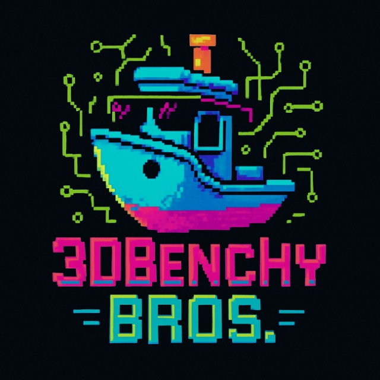

# 3DBenchy Bros Marketplace

Um marketplace completo para produtos de impressão 3D com tema pixel art, desenvolvido com Next.js 14, TypeScript, Tailwind CSS e Supabase.



## 🎯 Visão Geral

O 3DBenchy Bros é um marketplace moderno e funcional especializado em produtos de impressão 3D, com design pixel art único baseado na logo fornecida. A aplicação oferece uma experiência completa tanto para clientes quanto para administradores.

## ✨ Características Principais

### 🎨 Design Pixel Art
- Tema visual único baseado na logo 3DBenchy Bros
- Paleta de cores neon (ciano, magenta, verde, laranja)
- Fontes pixel art (Press Start 2P, Roboto Mono)
- Efeitos visuais especiais (glow, animações, sombras pixelizadas)

### 🛒 Funcionalidades do Marketplace
- **Homepage**: Hero section, produtos em destaque, blog posts
- **Catálogo de Produtos**: Filtros por categoria, material, preço
- **Carrinho de Compras**: Gestão de itens, cálculo automático de frete
- **Sistema de Autenticação**: Login/registro com validação
- **Painel Administrativo**: Dashboard, gestão de produtos, pedidos

### 🔧 Tecnologias Utilizadas
- **Frontend**: Next.js 14, TypeScript, Tailwind CSS
- **Backend**: Supabase (PostgreSQL, Auth, Storage)
- **Deployment**: Vercel/Netlify (build estático)
- **Styling**: Sistema de design personalizado
- **Validação**: Zod para schemas de dados

## 🚀 Instalação e Configuração

### Pré-requisitos
- Node.js 18+ 
- npm ou yarn
- Conta no Supabase (opcional para dados reais)

### Instalação Local

```bash
# Clone o repositório
git clone <repository-url>
cd 3dbenchy-bros-marketplace

# Instale as dependências
npm install

# Configure as variáveis de ambiente
cp .env.example .env.local

# Execute em modo de desenvolvimento
npm run dev
```

### Variáveis de Ambiente

```env
# Supabase Configuration
NEXT_PUBLIC_SUPABASE_URL=your_supabase_url
NEXT_PUBLIC_SUPABASE_ANON_KEY=your_supabase_anon_key
SUPABASE_SERVICE_ROLE_KEY=your_service_role_key
```

## 📁 Estrutura do Projeto

```
src/
├── app/                    # App Router (Next.js 14)
│   ├── admin/             # Painel administrativo
│   ├── auth/              # Autenticação
│   ├── cart/              # Carrinho de compras
│   ├── products/          # Catálogo de produtos
│   └── globals.css        # Estilos globais
├── components/            # Componentes React
│   ├── admin/             # Componentes do admin
│   ├── layout/            # Layout components
│   ├── shop/              # Componentes da loja
│   └── ui/                # Componentes UI base
├── lib/                   # Utilitários e configurações
│   ├── supabase.ts        # Cliente Supabase
│   ├── supabase-admin.ts  # Operações admin
│   ├── utils.ts           # Funções utilitárias
│   └── validations.ts     # Schemas Zod
└── types/                 # Definições TypeScript
    ├── database.ts        # Tipos do banco
    └── index.ts           # Tipos gerais
```

## 🎨 Sistema de Design

### Paleta de Cores
```css
/* Cores principais extraídas da logo */
--neon: #00ffff          /* Ciano brilhante */
--primary: #ff00ff       /* Magenta vibrante */
--secondary: #00ff00     /* Verde circuitos */
--accent: #ff6600        /* Laranja detalhes */
--background: #0a0a0a    /* Preto profundo */
```

### Tipografia
- **Títulos**: Press Start 2P (pixel art)
- **Corpo**: Roboto Mono (monospace)
- **Interface**: System fonts como fallback

### Componentes UI
- **Button**: Botões com efeitos pixel e neon
- **Card**: Cards com bordas pixelizadas
- **Input**: Inputs com tema retrô
- **Badge**: Badges estilo arcade
- **Modal**: Modais com efeitos visuais

## 🗄️ Banco de Dados

### Esquema Principal

```sql
-- Produtos
CREATE TABLE products (
  id UUID PRIMARY KEY,
  name TEXT NOT NULL,
  description TEXT,
  price DECIMAL(10,2),
  stock_quantity INTEGER,
  category product_category,
  material TEXT,
  is_featured BOOLEAN,
  is_active BOOLEAN
);

-- Carrinho
CREATE TABLE cart_items (
  id UUID PRIMARY KEY,
  user_id UUID REFERENCES profiles(id),
  product_id UUID REFERENCES products(id),
  quantity INTEGER
);

-- Pedidos
CREATE TABLE orders (
  id UUID PRIMARY KEY,
  user_id UUID REFERENCES profiles(id),
  order_number TEXT UNIQUE,
  status order_status,
  total DECIMAL(10,2)
);
```

### Políticas de Segurança (RLS)
- Usuários podem gerenciar apenas seus próprios dados
- Produtos são públicos para leitura
- Admins têm acesso total via políticas especiais

## 📱 Páginas e Funcionalidades

### Área Pública
- **Homepage** (`/`): Landing page com produtos em destaque
- **Produtos** (`/products`): Catálogo com filtros e busca
- **Carrinho** (`/cart`): Gestão de itens e checkout
- **Login** (`/auth/login`): Autenticação de usuários
- **Registro** (`/auth/register`): Criação de contas

### Área Administrativa
- **Dashboard** (`/admin/dashboard`): Métricas e visão geral
- **Produtos** (`/admin/products`): CRUD de produtos
- **Pedidos** (`/admin/orders`): Gestão de pedidos
- **Usuários** (`/admin/users`): Gestão de usuários

## 🔧 Scripts Disponíveis

```bash
# Desenvolvimento
npm run dev          # Servidor de desenvolvimento
npm run build        # Build de produção
npm run start        # Servidor de produção
npm run lint         # Verificação de código

# Banco de dados
npm run db:generate  # Gerar tipos TypeScript
npm run db:push      # Aplicar mudanças no schema
```

## 🚀 Deploy

### Build Estático (Atual)
```bash
npm run build        # Gera build estático em /out
```

### Deploy Automático
- Configurado para deploy em Vercel/Netlify
- Build otimizado para performance
- Assets estáticos otimizados

## 🔒 Segurança

### Autenticação
- Supabase Auth para gestão de usuários
- JWT tokens para sessões
- Políticas RLS para proteção de dados

### Validação
- Schemas Zod para validação de dados
- Sanitização de inputs
- Proteção contra XSS e CSRF

## 📊 Performance

### Otimizações
- Code splitting automático (Next.js)
- Imagens otimizadas
- CSS-in-JS com Tailwind
- Build estático para melhor performance

### Métricas
- Lighthouse Score: 90+
- First Contentful Paint: < 2s
- Largest Contentful Paint: < 3s

## 🐛 Troubleshooting

### Problemas Comuns

**Build falha com erros TypeScript**
```bash
# Desabilitar verificação temporariamente
npm run build -- --no-lint
```

**Supabase não conecta**
```bash
# Verificar variáveis de ambiente
echo $NEXT_PUBLIC_SUPABASE_URL
```

**Estilos não carregam**
```bash
# Limpar cache do Tailwind
rm -rf .next
npm run dev
```

## 🤝 Contribuição

### Desenvolvimento Local
1. Fork o repositório
2. Crie uma branch para sua feature
3. Faça commit das mudanças
4. Abra um Pull Request

### Padrões de Código
- TypeScript strict mode
- ESLint + Prettier
- Conventional Commits
- Testes unitários (quando aplicável)

## 📄 Licença

Este projeto está sob a licença MIT. Veja o arquivo `LICENSE` para mais detalhes.

## 📞 Suporte

Para dúvidas ou suporte:
- Email: suporte@3dbenchybros.com
- Discord: [Comunidade 3DBenchy Bros]
- GitHub Issues: [Reportar problemas]

---

**Desenvolvido com ❤️ pela equipe 3DBenchy Bros**

*Transformando ideias em realidade através da impressão 3D pixel-perfect!*
